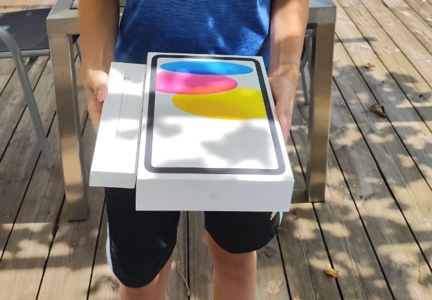

# 💻 Hack Club Arcade 2024

Hack Club Arcade was a summer event in 2024 where high school students (and younger) built projects, tracked the time they spent coding, and received tickets based on their hours. These tickets could then be exchanged for prizes.

---

## 🌟 My Experience

I decided to participate in Hack Club Arcade mainly because the prizes looked interesting, but it quickly turned into something much more. Over the course of the event I built multiple projects, all of which are stored in this repository.

Working on these projects was a lot of fun. During the event I:
- explored new technologies  
- experimented with different ideas  
- improved my programming skills  
- stayed consistently motivated to keep building

---

## 🏆 Prize

After collecting enough tickets, I redeemed them for a prize:

---

## 📑 Arcade Website

You can learn more about the event here:  
👉 https://hackclub.com/arcade/