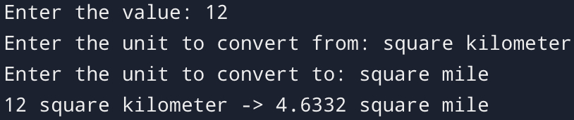

# 📏 | Area Converter

A Python script to convert areas between different units. Units are defined in `converter.py` from lines 1-12.

## ⚙️ | Installation

1. Clone the repository.
2. Ensure you have Python installed on your system.
3. Run `converter.py` using Python.

## 🖼️ | Screenshot

## 💌 | Contact

If you have any questions, you can contact me on Discord: @nikitafrfr.

If you came here from the Hackclub Slack, you can just contact me there :)
