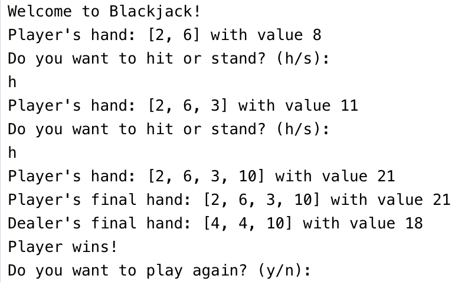

# ♠️ | Blackjack Game

A simplified version of Blackjack implemented in Python.

## ⚙️ | Installation

To run this game locally, download the `game.py` file. Run it using Python to start the game.

## 🖼️ | Screenshot

## ✉️ | Questions

If you have any questions, you can contact me on Discord: @nikitafrfr.

If you came here from the Hackclub Slack, you can reach out to me there as well :)
