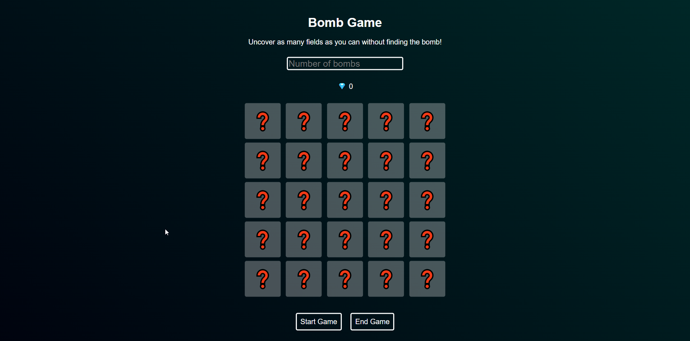

# 💥 | Bomb Game

This project contains a bomb game where you need to find as many diamonds as possible without hitting the bomb. It’s similar to Minesweeper but with a bit more gambling. Built with HTML, CSS, and JavaScript, it features a user-friendly interface and can be played directly in the browser.

## ⚙️ | Installation

To run this game locally, download the following files:
- `index.html`
- `style.css`
- `index.js`

After downloading, open `index.html` in your browser to start playing.

## 🌐 | Try it Online

Alternatively, you can play the game [here](https://hackclub.nik-dev.eu/bomb-game/).

## 🖼️ | Screenshot

## ✉️ | Questions

If you have any questions, you can contact me on Discord: @nikitafrfr.

If you came here from the Hackclub Slack, you can reach out to me there as well :)
