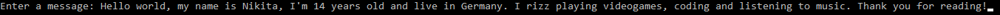

# 🧠 | Brainslot Translator

This project includes a Brainslot Translator that converts standard text into brainrot by replacing common nouns, verbs, and adjectives with their brainrot counterparts. It utilizes multiple text files for the translation process.

## ⚙️ | Installation

To use this translator, download the `translator.py` file along with the accompanying text files. Finally run the `translator.py` script.

## 🖼️ | Screenshots

## ✉️ | Questions

If you have any questions, you can contact me on Discord: @nikitafrfr.

If you came here from the Hackclub Slack, you can reach out to me there as well :)