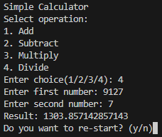

# ➕ | Simple Calculator

This project includes a basic calculator implemented in Python. It can perform addition, subtraction, multiplication, and division. The calculator allows users to select an operation and input two numbers to receive a result.

## ⚙️ | Installation

To use this calculator, download the `calculator.py` file. Run the `calculator.py` script to start using the calculator.

## 🖼️ | Screenshot

## ✉️ | Questions

If you have any questions, you can contact me on Discord: @nikitafrfr.

If you came here from the Hackclub Slack, you can reach out to me there as well :)
