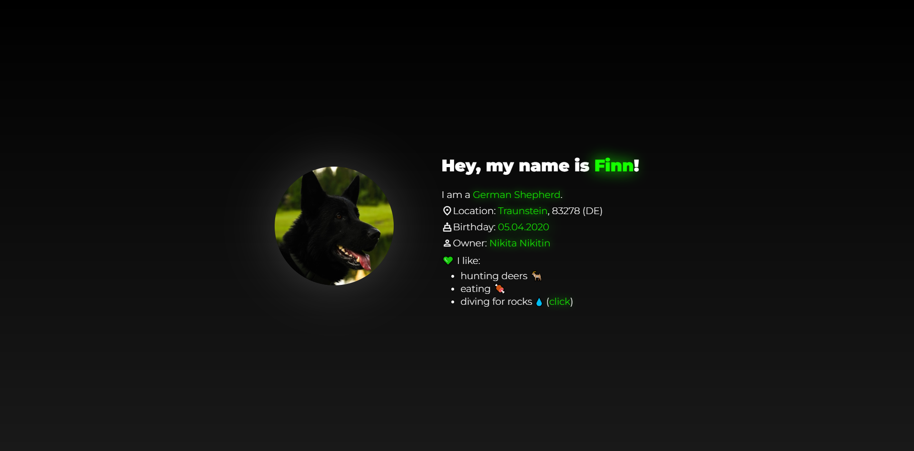

# 🐾 | Finn's Website

This project contains a website dedicated to my dog, Finn. The site features a dark mode design and includes a few animations for a nice experience. 

## ⚙️ | Installation

To set up this website, download the following files:
- `index.html`
- `style.css`
- `index.js`
- `icon.png`

Also, be sure to include the images from the `images/` subfolder.

## 🌐 | Try it Online

Alternatively, you can view the website [here](https://hackclub.nik-dev.eu/finn/).

## 🖼️ | Screenshot

## ✉️ | Questions

If you have any questions, you can contact me on Discord: @nikitafrfr.

If you came here from the Hackclub Slack, you can reach out to me there as well :)
