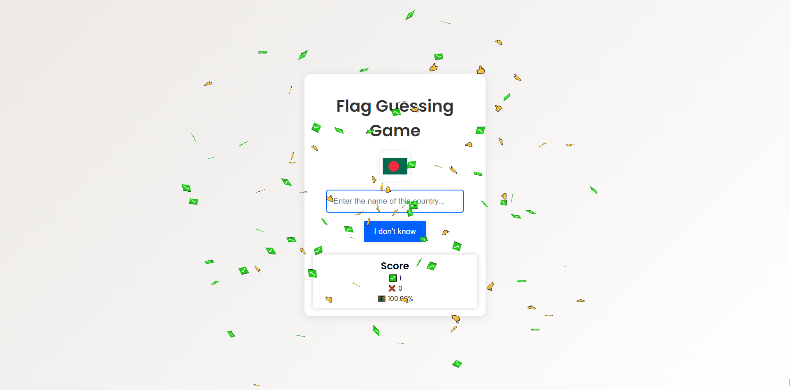

# 🚩 | Flag Guessing Game

I created a Flag Guessing Game using [the FlagsAPI](https://flagsapi.com/). The game presents you with a flag, and your task is to guess the country.

## ⚙️ | Installation

To set up the game, download the following files:
- `index.html`
- `style.css`
- `index.js`

## 🌐 | Try it Online

Alternatively, you can play the game [here](https://hackclub.nik-dev.eu/flag-game/).

## 🖼️ | Screenshot

## ✉️ | Questions

If you have any questions, you can contact me on Discord: @nikitafrfr.

If you came here from the Hackclub Slack, you can reach out to me there as well :)
