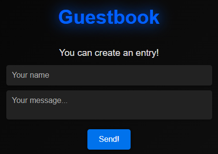

# 📖 | Guestbook Website

This project features a guestbook website with a fully functional API. It includes both frontend and backend components.

## ⚙️ | Installation

To set up this project, follow these steps:

1. **Download Files:**
   - From the main folder, download:
     - `index.html`
     - `style.css`
     - `index.js`
   - From the `backend/` folder, download all files, including `index.js`.

2. **Install Dependencies:**
   Navigate to the `backend/` folder in your terminal and run `npm install sqlite3 express` to install the required npm libraries.

3. **Run the Backend:**
   Start the backend server by running `node .` in the `backend/` folder.

## 🌐 | Try it Online

You can (only) view the guestbook website [here](https://hackclub.nik-dev.eu/guestbook/).

## 🖼️ | Screenshot

## ✉️ | Questions

If you have any questions, you can contact me on Discord: @nikitafrfr.

If you came here from the Hackclub Slack, you can reach out to me there as well :)
