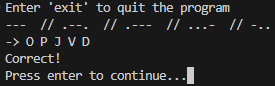

# 📜 | Morse Code Game

This project is a Morse Code game where you guess a random string of 5 letters based on its Morse Code representation. The game clears the screen, shows a Morse Code string, and prompts you to guess the original string.

## ⚙️ | Installation

To run this game, download the `main.py` file. Ensure you have Python installed on your system. You can then run the game using the command `python main.py`.

## 🖼️ | Screenshot

## ✉️ | Questions

If you have any questions, you can contact me on Discord: @nikitafrfr.

If you came here from the Hackclub Slack, you can reach out to me there as well :)
