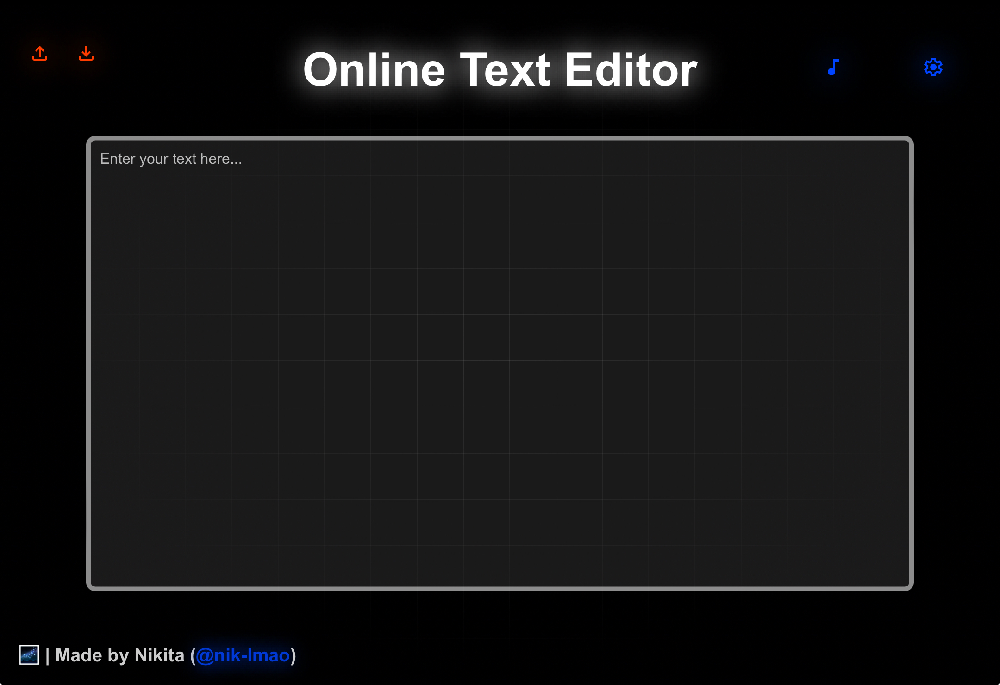

# 📝 | Online Text Editor

A simple online tool to upload, edit, and download text files. Built with HTML, CSS, and JavaScript.

## ⚙️ | Installation

1. Clone the repository.
2. Open `index.html` in your browser.

## 🌐 | Try it Online

Alternatively, you can test it [here](https://nik-lmao.github.io/small-projects/online-text-editor/).

## 🖼️ | Screenshot

## 💌 | Contact

If you have any questions, you can contact me on Discord: @nikitafrfr.

If you came here from the Hackclub Slack, you can just contact me there :)