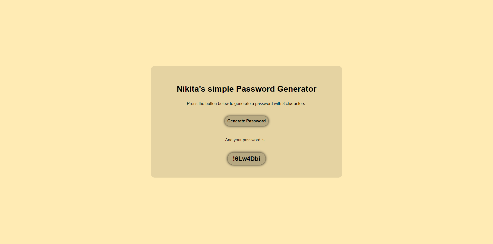

# 🔐 | Password Generator

This project is a password generator that creates unique and secure passwords.

## ⚙️ | Installation

To set up this password generator, download the following files:
- `index.html`
- `style.css`
- `index.js`

Open the `index.html` file in your browser to start using the generator.

## 🌐 | Try it Online

You can access the password generator [here](https://hackclub.nik-dev.eu/password-generator).

## 🖼️ | Screenshot

## ✉️ | Questions

If you have any questions, you can contact me on Discord: @nikitafrfr.

If you came here from the Hackclub Slack, you can reach out to me there as well :)
