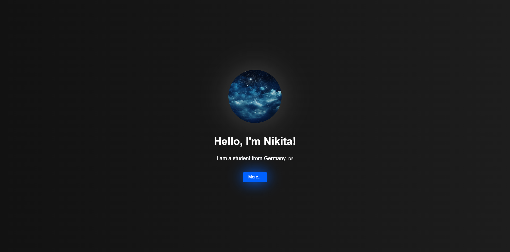

# 🌐 | Personal Website

This project is a personal website showcasing information about me. It features a user-friendly interface.

## ⚙️ | Installation

To set up this personal website, download the following files:
- `index.html`
- `style.css`
- `index.js`

Open the `index.html` file in your browser to view the website.

## 🌐 | Try it Online

Alternatively, you can access the website [here](https://hackclub.nik-dev.eu/personal-website/).

## 🖼️ | Screenshot

## ✉️ | Questions

If you have any questions, you can contact me on Discord: @nikitafrfr.

If you came here from the Hackclub Slack, you can reach out to me there as well :)
