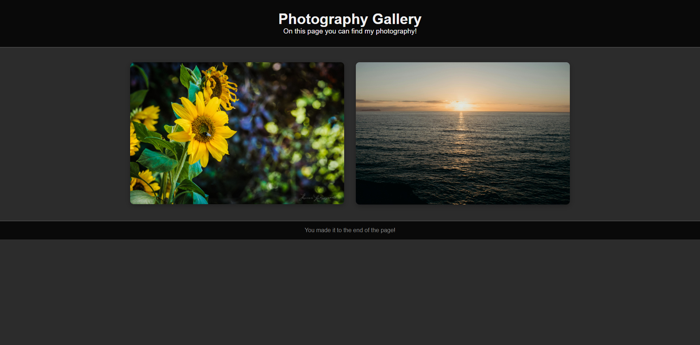

# 📸 | Photography Gallery

This project features a photography gallery that displays multiple photos on a webpage. It showcases a collection of images in an organized and visually appealing layout.

## ⚙️ | Installation

To set up the photography gallery, download the following files:
- `index.html`
- `style.css`
- `index.js`

Open the `index.html` file in your browser to view the gallery.

## 🌐 | Try it Online

Alternatively, you can access the gallery [here](https://hackclub.nik-dev.eu/photography-gallery/).

## 🖼️ | Screenshot

## ✉️ | Questions

If you have any questions, you can contact me on Discord: @nikitafrfr.

If you came here from the Hackclub Slack, you can reach out to me there as well :)
