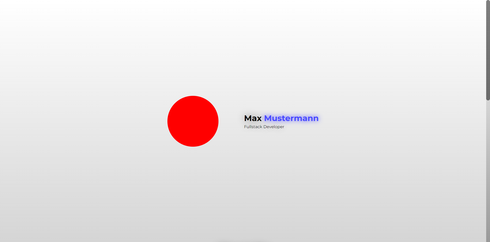

# 🎨 | Portfolio

This project is a personal portfolio showcasing various works and projects. It includes both frontend and backend components to provide a comprehensive view of my work.

## ⚙️ | Installation

To set up this portfolio, follow these steps:

1. **Frontend Setup:**
   Download the following files from the main folder:
   - `index.html`
   - `style.css`
   - `index.js`

2. **Backend Setup:**
   Download all files from the `api/` subfolder.

3. **Install Dependencies:**
   Navigate to the `api/` folder in your terminal and run `npm install` to install the required npm libraries.

4. **Run the Backend:**
   Start the backend server by running `node .` in the `api/` folder.

5. **View the Portfolio:**
   Open the `index.html` file in your browser to view the portfolio.

## 🌐 | Try it Online

You can access the portfolio [here](https://hackclub.nik-dev.eu/portfolio/). (contact page will **not** work)

## 🖼️ | Screenshot

## ✉️ | Questions

If you have any questions, you can contact me on Discord: @nikitafrfr.

If you came here from the Hackclub Slack, you can reach out to me there as well :)
