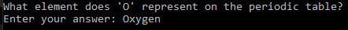

# 🧠 | Python Quiz Game

This project includes a Python quiz game where players can answer multiple-choice questions to test their knowledge. The game offers two types of quizzes: a default set and a user-defined set. 

## ⚙️ | Installation

1. **Download the Files**: Download all the files in the repository.

2. **Install Dependencies**: Navigate to the project directory and install the required Python libraries using the following command:

   `pip install -r requirements.txt`

3. **Setup the Quiz Game**: 
   - The `default.json` file contains a predefined set of quiz questions.
   - Use `own.py` to add new questions to the `questions.json` file if you wish to create your own quiz.

4. **Run the Quiz**: To start the quiz game, run the `quiz.py` script using:

   `python quiz.py`

## 🖼️ | Screenshot

## ✉️ | Questions

If you have any questions, you can contact me on Discord: @nikitafrfr.

If you came here from the Hackclub Slack, you can reach out to me there as well :)
