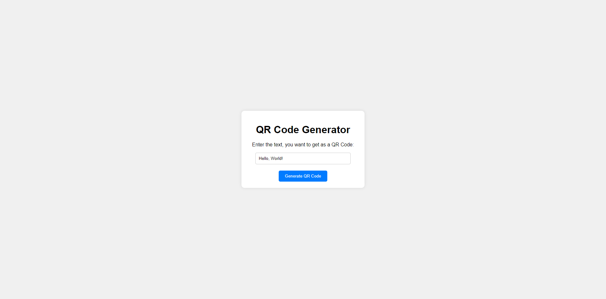

# 📱 | QR Code Generator

This project is a simple web-based QR Code generator. It allows users to input text and generate a QR code for that text. The design features a clean interface with a straightforward user experience.

## ⚙️ | Installation

1. **Download the Files**: Download the `index.html`, `style.css`, and `index.js` files from the repository.

2. **Run the Project**: Open the `index.html` file in your web browser to start using the QR Code Generator.

## 🌐 | Try it Online

Alternatively, you can access the QR Code Generator [here](https://hackclub.nik-dev.eu/qr-code-generator/).

## 🖼️ | Screenshot

## ✉️ | Questions

If you have any questions, you can contact me on Discord: @nikitafrfr.

If you came here from the Hackclub Slack, you can reach out to me there as well :)
