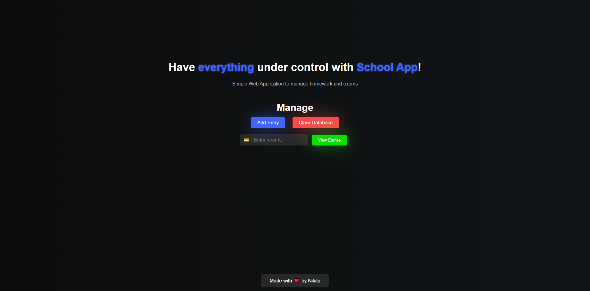

# 🏫 | School App

This project features a school management app with a web interface and an Express API.

## ⚙️ | Installation

1. **Web Pages:** Download all the HTML, CSS, and JavaScript files, as well as the subfolders. Open the `index.html` file in your web browser to view the app.

2. **Express API:**
   - Navigate to the `api/` subfolder.
   - Install dependencies by running `npm install`.
   - Start the server using `npm start`.

## 🌐 | Try it Online

Alternatively you can also access the app [here](https://hackclub.nik-dev.eu/school-app/). (front-end only!)

## 🖼️ | Screenshot

## ✉️ | Questions

If you have any questions you can contact me on Discord: @nikitafrfr

If you came here from the Hackclub Slack, you can just contact me there :)
