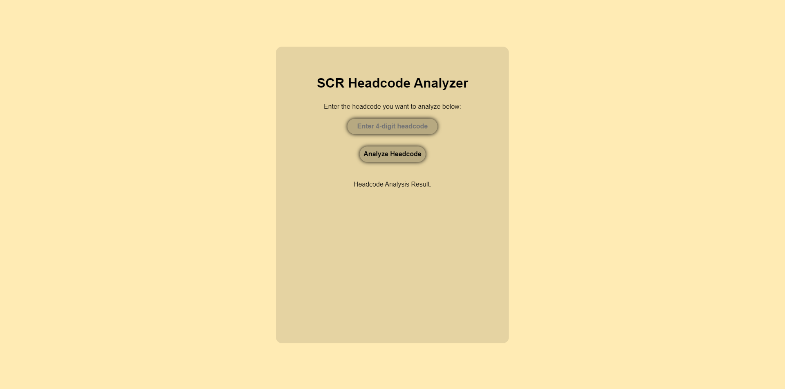

# 🚂 | SCR Headcode Analyzer

This project includes a tool for analyzing headcodes used in the SCR (Stepford County Railway) railway simulator on Roblox. The tool determines the train class and destination based on the 4-digit headcode.

## ⚙️ | Installation

1. **Web Page:**
   - Download all the webpage files from the project.
   - Open the `index.html` file in your web browser to use the headcode analyzer tool online.

2. **Python Script:**
   - Ensure you have Python installed.
   - Download the `main.py` file.
   - Run the script directly using `python main.py`.

## 🌐 | Try it Online

You can access the web-based version of the SCR Headcode Analyzer [here](https://hackclub.nik-dev.eu/scr-headcode-analyzer/).

## 🖼️ | Screenshot

## ✉️ | Questions

If you have any questions you can contact me on Discord: @nikitafrfr

If you came here from the Hackclub Slack, you can just contact me there :)