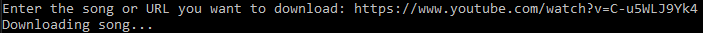

# 🎵 | YouTube Sound/Music Downloader

This project contains a YouTube sound/music downloader written in Python. It allows you to download audio by providing a YouTube link or by entering the name of the sound/music.

## ⚙️ | Installation

1. **Dependencies:** Install the required Python packages using the `requirements.txt` file. (`pip install -r requirements.txt` in terminal)

2. **Usage:** Run the `main.py` script to start the downloader. Follow the prompts to provide the YouTube link or enter the name of the sound/music you wish to download.

## 🖼️ | Screenshot

## ✉️ | Questions

If you have any questions, you can contact me on Discord: @nikitafrfr

If you came here from the Hackclub Slack, you can just contact me there :)