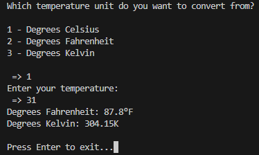

# 🌡️ | Temperature Converter

This project is a temperature conversion tool written in Python. It allows you to convert temperatures between Celsius, Fahrenheit, and Kelvin.

## ⚙️ | Installation

1. **Setup:** Make sure you have Python installed on your system.

2. **Run the Script:** Download the `main.py` file and execute it using Python. 

3. **Usage:** Follow the prompts in the command line to choose the temperature unit you want to convert from, enter the temperature, and get the conversions.

## 🖼️ | Screenshot

## ✉️ | Questions

If you have any questions, you can contact me on Discord: @nikitafrfr

If you came here from the Hackclub Slack, you can just contact me there :)