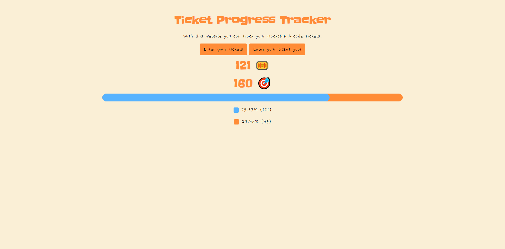

# 🎟️ | Ticket Counter for Hackclub Arcade 2024

This project features a simple web page for a ticket counter specifically designed for Hackclub Arcade 2024.

## ⚙️ | Installation

1. **Setup:** Download all the web page files from the project.

2. **Open the Web Page:** Open the `index.html` file in your web browser to use the ticket counter.

## 🌐 | Try it Online

Alternatively, you can try it out online [here](https://hackclub.nik-dev.eu/ticket-counter/).

## 🖼️ | Screenshot

## ✉️ | Questions

If you have any questions, you can contact me on Discord: @nikitafrfr

If you came here from the Hackclub Slack, you can just contact me there :)
