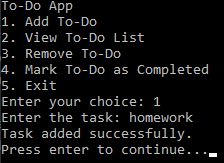
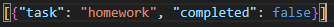

# 🗒️ | To-Do App

This project is a simple To-Do application that allows you to manage tasks. You can add, view, remove, and mark tasks as completed.

## ⚙️ | Installation

1. **Setup:** Download the `to-do.py` file.

2. **Run the Application:**
   - Ensure you have Python installed on your machine.
   - Open a terminal or command prompt.
   - Navigate to the directory containing `to-do.py`.
   - Run the script using the command: `python to-do.py`.

## 🖼️ | Screenshots

## ✉️ | Questions

If you have any questions, you can contact me on Discord: @nikitafrfr

If you came here from the Hackclub Slack, you can just contact me there :)