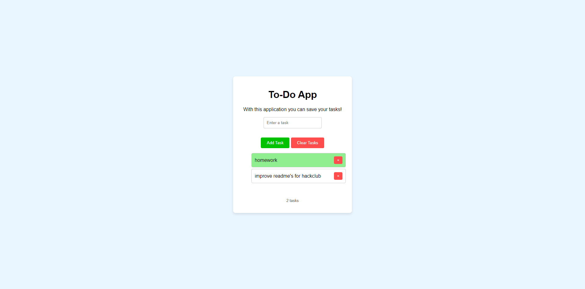

# 🗒️ | To-Do App

This project is a simple To-Do application built with HTML, CSS, and JavaScript. It allows you to manage tasks by adding, viewing, removing, and marking tasks as completed.

## ⚙️ | Installation

1. **Download the Files:**
   - Download all the HTML, CSS, and JavaScript files from this repository.

2. **Open the App:**
   - Open the `index.html` file in your web browser to start using the app.

## 🌐 | Try it Online

You can try the To-Do app online by visiting [this link](https://hackclub.nik-dev.eu/todo-app/).

## 🖼️ | Screenshot

## ✉️ | Questions

If you have any questions, you can contact me on Discord: @nikitafrfr

If you came here from the Hackclub Slack, you can just contact me there :)
