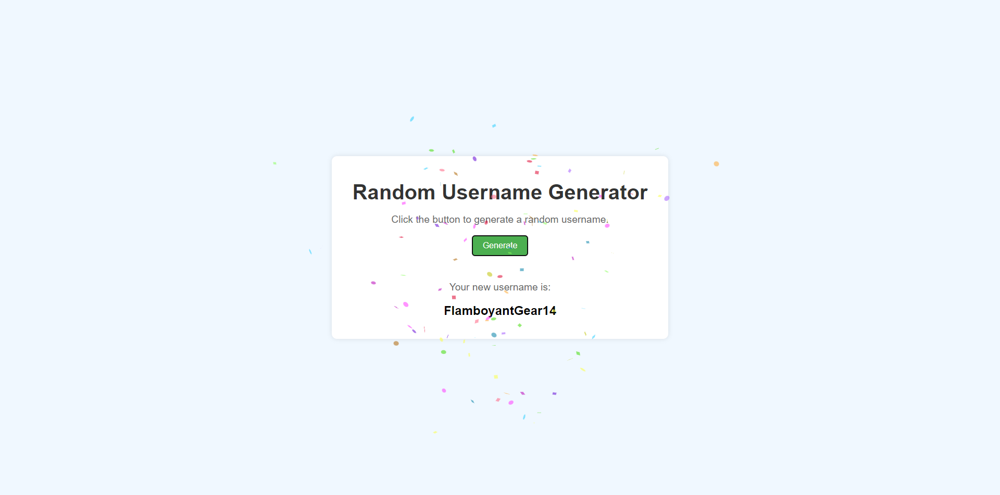

# 👤 | Unique Username Generator

This project contains a username generator which can generate over 10 million unique names.

## 💾 | Installation

### Python Script

1. Download the following files:
   - `generator.py`
   - `adjectives.txt`
   - `nouns.txt`

2. Run the `generator.py` file to generate a random username.

### Web Version

1. Download the following files:
   - `index.html`
   - `style.css`
   - `index.js`

2. Open the `index.html` file in your web browser to view and use the app.

## 🌐 | Try it Online

Alternatively, you can access the website [here](https://hackclub.nik-dev.eu/username-generator/).

## 🖼️ | Screenshot

## ✉️ | Questions

If you have any questions, you can contact me on Discord: @nikitafrfr

If you came here from the Hackclub Slack, you can just contact me there :)
