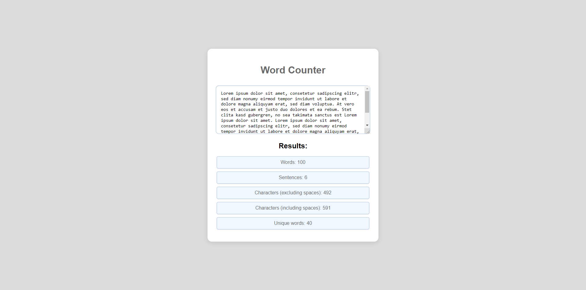

# 📝 | Word Counter

This project contains a tool for counting words, sentences, characters, and unique words in a given text. It is available both as a Python script and a web application.

## 💾 | Installation

### Python Script

1. Download the following file:
   - `counter.py`

2. Run the `counter.py` file to start the application. You can enter text directly into the console to get the counts for words, sentences, characters, and unique words.

### Web Version

1. Download the following files:
   - `index.html`
   - `style.css`
   - `index.js`

2. Open the `index.html` file in your web browser to use the web-based word counter.

## 🌐 | Try it Online

Alternatively, you can access the web version of the word counter [here](https://hackclub.nik-dev.eu/word-counter/).

## 🖼️ | Screenshot

## ✉️ | Questions

If you have any questions, you can contact me on Discord: @nikitafrfr

If you came here from the Hackclub Slack, you can just contact me there :)
